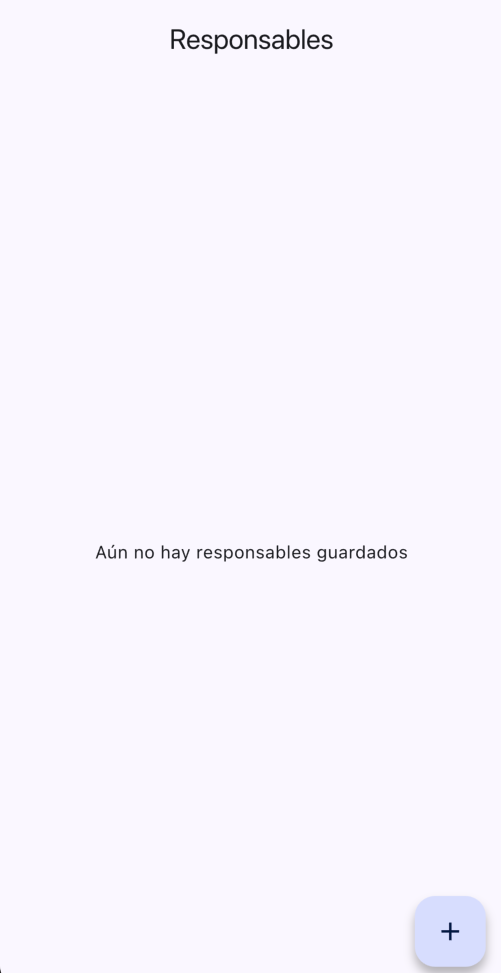
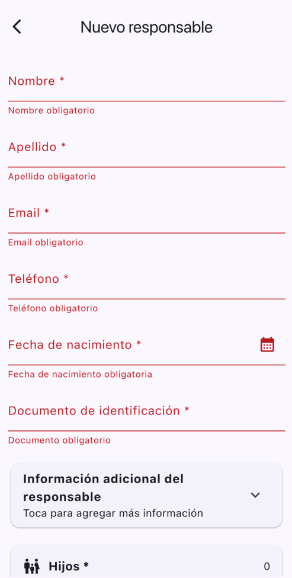
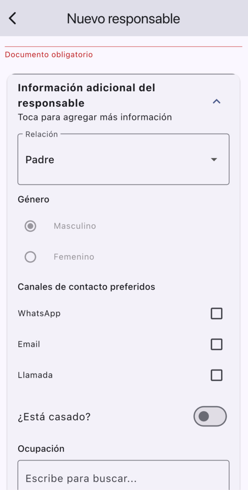
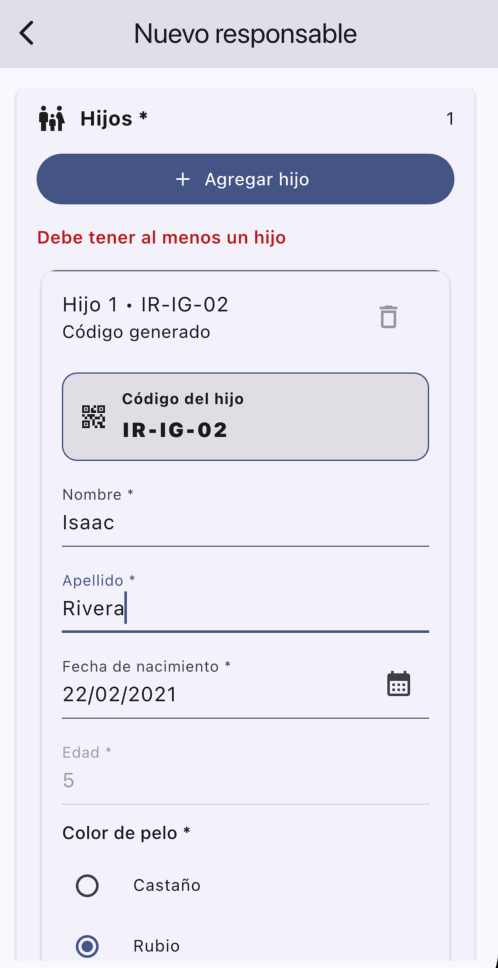

# dynamic_forms

SDK utilizado: 3.7.2

## Importante:
antes de correr el proyecto correr este comando para las bases de datos

dart run build_runner build --delete-conflicting-outputs

## Descripción del proyecto

La aplicación permite registrar la información de un responsable (padre, madre o tutor) y gestionar dinámicamente el registro de sus hijos, generando un código único por cada hijo según reglas de negocio específicas.

## Objetivo de la prueba
Registrar información obligatoria de un responsable.

Registrar múltiples hijos de forma dinámica.

Generar automáticamente un código único por hijo.

Detectar y manejar códigos duplicados.

Aplicar validaciones formales de datos.

Persistir la información localmente.

Mantener una arquitectura limpia y escalable.

## Tecngologías utilizadas

Flutter

Dart

Riverpod

Hive

Material Design

## Arquitectura aplicada

El proyecto está estructurado siguiendo un enfoque modular basado en features, con separación clara de responsabilidades por capas. Los niveles superiores del proyecto son:

- core

- features

Esta organización permite mantener el código desacoplado, escalable y fácil de mantener.

### 1. core 
La carpeta core contiene elementos transversales que pueden ser reutilizados por cualquier feature del proyecto.

core/constants

Constantes globales utilizadas en la aplicación, como listas de opciones, valores fijos o configuraciones estáticas.

core/routes

Definición centralizada de rutas de navegación.

core/validators

Validadores reutilizables para campos como:

Email

Teléfono

Documento de identificación

Fechas

Requeridos

Estos validadores son utilizados por los casos de uso en la capa de dominio.

### 2. Features

Cada funcionalidad principal del sistema se organiza dentro de features.
En este proyecto, la funcionalidad principal es el manejo de formularios dinámicos, ubicada en features/forms

Cada feature está dividida en tres capas

- data

- domain

- presentation

## Decisiones de Diseño

Se utilizó un enfoque basado en features para evitar una arquitectura centrada en capas globales que crece desordenadamente.

Se separó claramente la lógica de negocio de la interfaz.

Se encapsuló el acceso a Hive detrás de un repositorio.

Se utilizaron mappers para evitar acoplar modelos de almacenamiento con modelos de presentación.

Se implementó gestión de estado con Riverpod para mantener el flujo predecible y desacoplado.

